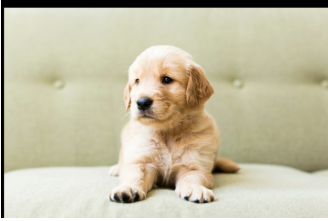
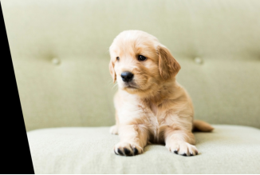
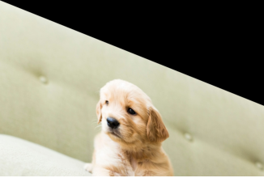
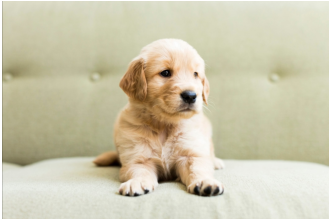
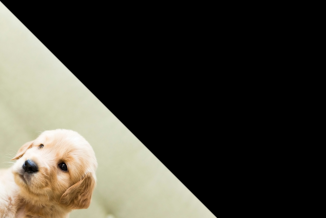

# Image-Transformation
## Aim
To perform image transformation such as Translation, Scaling, Shearing, Reflection, Rotation and Cropping using OpenCV and Python.

## Software Required:
Anaconda - Python 3.7

## Algorithm:
### Step1: Import the necessary libraries and read the original image and save it as a image variable.
<br>

### Step2: Translate the image using M=np.float32([[1,0,20],[0,1,50],[0,0,1]]) translated_img=cv2.warpPerspective(input_img,M,(cols,rows))
<br>

### Step3: Scale the image using M=np.float32([[1.5,0,0],[0,2,0],[0,0,1]]) scaled_img=cv2.warpPerspective(input_img,M,(cols,rows))
<br>

### Step4: Shear the image using M_x=np.float32([[1,0.2,0],[0,1,0],[0,0,1]]) sheared_img_xaxis=cv2.warpPerspective(input_img,M_x,(cols,rows))
<br>

### Step5: Reflection of image can be achieved through the code M_x=np.float32([[1,0,0],[0,-1,rows],[0,0,1]]) reflected_img_xaxis=cv2.warpPerspective(input_img,M_x,(cols,rows))
<br>

### Step6:Rotate the image using angle=np.radians(45) M=np.float32([[np.cos(angle),-(np.sin(angle)),0],[np.sin(angle),np.cos(angle),0],[0,0,1]]) rotated_img=cv2.warpPerspective(input_img,M,(cols,rows))
<br>

### Step7: Crop the image using cropped_img=input_img[20:150,60:230]
<br>

### Step8: Display all the Transformed images and end the program. 

## Program:
```python
Developed By: Aadheeshwar.A
Register Number: 212221230001
import numpy as np
import cv2
import matplotlib.pyplot as plt
input_img=cv2.imread("dog.jpg")
input_img=cv2.cvtColor(input_img,cv2.COLOR_BGR2RGB)
plt.axis('off')
plt.imshow(input_img)
plt.show()
rows,cols,dim=input_img.shape
i)Image Translation:
M=np.float32([[1,0,20],
             [0,1,50],
             [0,0,1]])
translated_img=cv2.warpPerspective(input_img,M,(cols,rows))
plt.axis('off')
plt.imshow(translated_img)
plt.show()

ii) Image Scaling:

M=np.float32([[1.5,0,0],
             [0,2,0],
             [0,0,1]])
scaled_img=cv2.warpPerspective(input_img,M,(cols,rows))
plt.axis('off')
plt.imshow(scaled_img)
plt.show()


iii)Image shearing:

M_x=np.float32([[1,0.2,0],
               [0,1,0],
               [0,0,1]])
M_y=np.float32([[1,0,0],
               [0.4,1,0],
               [0,0,1]])
sheared_img_xaxis=cv2.warpPerspective(input_img,M_x,(cols,rows))
sheared_img_yaxis=cv2.warpPerspective(input_img,M_y,(cols,rows))
plt.axis('off')
plt.imshow(sheared_img_xaxis)
plt.show()
plt.axis('off')
plt.imshow(sheared_img_yaxis)
plt.show()


iv)Image Reflection:


M_x=np.float32([[1,0,0],
               [0,-1,rows],
               [0,0,1]])
M_y=np.float32([[-1,0,cols],
               [0,1,0],
               [0,0,1]])
reflected_img_xaxis=cv2.warpPerspective(input_img,M_x,(cols,rows))
reflected_img_yaxis=cv2.warpPerspective(input_img,M_y,(cols,rows))
plt.axis('off')
plt.imshow(reflected_img_xaxis)
plt.show()
plt.axis('off')
plt.imshow(reflected_img_yaxis)
plt.show()

v)Image Rotation:

angle=np.radians(45)
M=np.float32([[np.cos(angle),-(np.sin(angle)),0],
               [np.sin(angle),np.cos(angle),0],
               [0,0,1]])
rotated_img=cv2.warpPerspective(input_img,M,(cols,rows))
plt.axis('off')
plt.imshow(rotated_img)
plt.show()


vi)Image Cropping:
cropped_img=input_img[20:150,60:230]
plt.axis('off')
plt.imshow(cropped_img)
plt.show()


```
## Output:
### i)Image Translation:

<br>
<br>


### ii) Image Scaling:

<br>
<br>
<br>
<br>


### iii)Image shearing:

<br>
<br>



<br>
<br>


### iv)Image Reflection:

<br>
<br>


<br>
<br>


### v)Image Rotation:

<br>
<br>


### vi)Image Cropping:

<br>
<br>


## Result: 

Thus the different image transformations such as Translation, Scaling, Shearing, Reflection, Rotation and Cropping are done using OpenCV and python programming.
